# Class Diagram — EZZAOUIA Platform Django Models

> **Complete data model** covering application models (Django-managed) and Data Warehouse read-only
> models (managed=False, mapped to SQL Server DWH tables via pyodbc / mssql-django).

```mermaid
classDiagram
    direction TB

    %% ═══════════════════════════════════════
    %% APPLICATION MODELS — Django managed
    %% ═══════════════════════════════════════

    class User {
        <<AbstractUser>>
        +int id
        +str username
        +str email
        +str first_name
        +str last_name
        +str password
        +bool is_active
        +datetime date_joined
        +datetime last_login
        +str role : admin | ingenieur | direction
        +str department
        +str phone
        +bool must_change_password
        +str password_reset_token
        +datetime password_reset_expires
        +datetime last_password_change
        +bool is_admin()
        +bool is_ingenieur()
        +bool is_direction()
    }

    class ChatSession {
        <<BaseModel>>
        +int id
        +str title
        +bool is_active
        +str share_token
        +bool is_shared
        +datetime shared_at
        +datetime created_at
        +datetime updated_at
        +get_first_question() str
    }

    class ChatMessage {
        <<BaseModel>>
        +int id
        +str question
        +str answer
        +float duration
        +float duration_seconds
        +bool is_satisfied
        +datetime created_at
        +datetime updated_at
    }

    class AnalysisComment {
        <<BaseModel>>
        +int id
        +str content
        +bool is_public
        +datetime created_at
        +datetime updated_at
    }

    class SessionShare {
        <<BaseModel>>
        +int id
        +bool viewed
        +datetime created_at
    }

    class UserMemory {
        <<BaseModel>>
        +int id
        +str well_code
        +str topic : PRODUCTION|BUDGET|WORKOVER|RESERVOIR|GENERAL
        +str summary
        +datetime updated_at
    }

    class UploadedFile {
        <<BaseModel>>
        +int id
        +str original_name
        +str file : FileField uploads/YYYY/MM/DD/
        +str file_type : pdf | docx | xlsx
        +str status : pending|processing|success|error
        +str error_msg
        +int rows_extracted
        +datetime created_at
        +datetime updated_at
    }

    class AuditLog {
        +int id
        +str action : LOGIN|LOGOUT|UPLOAD_FILE|CHATBOT_QUESTION|...
        +str details : JSON
        +str ip_address
        +str user_agent
        +datetime created_at
        +log(action, user, request) AuditLog
        +parsed_details() dict
        +duration_seconds() float
        +details_display() str
    }

    %% ═══════════════════════════════════════
    %% DATA WAREHOUSE — managed=False (SQL Server DWH)
    %% ═══════════════════════════════════════

    class DimDate {
        <<DWH - managed=False>>
        +int date_key PK
        +date full_date
        +int day
        +int month
        +int year
        +int quarter
        +str month_name
    }

    class DimWell {
        <<DWH - managed=False>>
        +int well_key PK
        +str well_code
        +str libelle
        +str layer
        +str closed
        +int max_prod
        +int ordre
        +bool is_active()
    }

    class DimWellStatus {
        <<DWH - managed=False>>
        +int well_status_key PK
        +decimal prod_hours
        +decimal bsw
        +decimal gor
        +decimal flow_temp
        +str choke
        +str tubing_psig
        +str casing_psig
        +str vess_pres
        +decimal power_fluid
        +decimal inj_pre
        +str remarque
    }

    class DimPowerType {
        <<DWH - managed=False>>
        +int power_type_key PK
        +int power_type_code
        +str power_type_name
    }

    class DimProdMethod {
        <<DWH - managed=False>>
        +int prod_method_key PK
        +int prod_method_code
        +str prod_method_name
    }

    class DimTypeWell {
        <<DWH - managed=False>>
        +int type_well_key PK
        +int type_well_code
        +str type_well_name
    }

    class DimTank {
        <<DWH - managed=False>>
        +int tank_key PK
        +str tank_code
        +str tank_name
    }

    class FactProduction {
        <<DWH Fact - managed=False>>
        +int fact_prod_key PK
        +int daily_oil : STB/day
        +decimal daily_gas : MSCF
        +decimal daily_water : BWPD
    }

    class FactTankLevel {
        <<DWH Fact - managed=False>>
        +int fact_tank_key PK
        +int volume_bbls
    }

    %% ═══════════════════════════════════════
    %% APPLICATION RELATIONSHIPS
    %% ═══════════════════════════════════════

    User        "1" --> "0..*" ChatSession     : owns (user)
    User        "1" --> "0..*" ChatSession     : shared_by
    User        "1" --> "0..*" AnalysisComment : writes (author)
    User        "1" --> "0..*" SessionShare    : sent_shares
    User        "1" --> "0..*" SessionShare    : received_shares
    User        "1" --> "0..*" UploadedFile    : uploads
    User        "1" --> "0..*" AuditLog        : generates
    User        "1" --> "0..*" UserMemory      : has memories

    ChatSession "1" --> "0..*" ChatMessage     : contains
    ChatSession "1" --> "0..*" SessionShare    : shared via

    ChatMessage "1" --> "0..*" AnalysisComment : has comments

    %% ═══════════════════════════════════════
    %% DWH SNOWFLAKE SCHEMA RELATIONSHIPS
    %% ═══════════════════════════════════════

    FactProduction  "N" --> "1"   DimDate       : DateKey
    FactProduction  "N" --> "1"   DimWell       : WellKey
    FactProduction  "N" --> "0..1" DimWellStatus : WellStatusKey

    DimWellStatus   "N" --> "1"   DimWell       : WellKey
    DimWellStatus   "N" --> "1"   DimDate       : DateKey

    FactTankLevel   "N" --> "1"   DimTank       : TankKey
    FactTankLevel   "N" --> "1"   DimDate       : DateKey

    DimWell         "N" --> "0..1" DimPowerType  : PowerTypeKey
    DimWell         "N" --> "0..1" DimProdMethod : ProdMethodKey
    DimWell         "N" --> "0..1" DimTypeWell   : TypeWellKey
```

