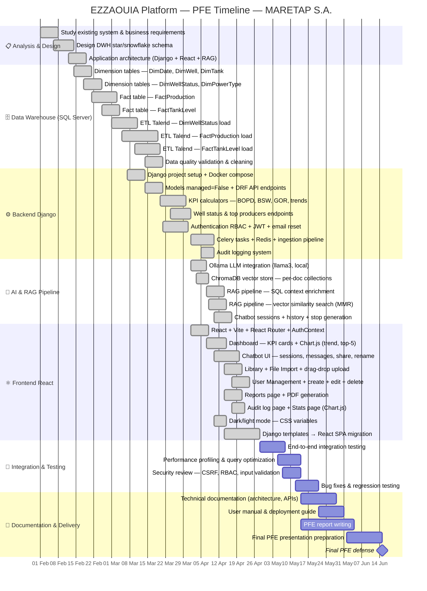

# Gantt Chart — EZZAOUIA Platform PFE Timeline

> **Project:** EZZAOUIA Platform — MARETAP S.A.
> **Student:** Aziz (Stage PFE)
> **Period:** February 2026 – June 2026
> **Stack:** Django 4.2 · React · SQL Server DWH · Ollama LLM · ChromaDB · Docker

