# Sequence Diagram — EZZAOUIA Platform

> **Four core system flows:** Authentication, KPI Dashboard, File Import (Celery + RAG), Chatbot RAG pipeline.
> Actors: User, React Frontend, Django API, SQL Server DWH, Celery Worker, ChromaDB, Ollama LLM.

```mermaid
sequenceDiagram
    autonumber

    actor       U   as 👤 User
    participant FE  as React Frontend
    participant API as Django API
    participant DB  as SQL Server DWH
    participant CEL as Celery Worker
    participant CHR as ChromaDB
    participant LLM as Ollama LLM (llama3)

    %% ═══════════════════════════════════════════════════
    %% 1. AUTHENTICATION FLOW
    %% ═══════════════════════════════════════════════════
    rect rgb(10, 30, 70)
        Note over U, DB: ① AUTHENTICATION — Session-based login
        U  ->> FE  : Enter username + password
        FE ->> API : POST /accounts/login/ {username, password}
        API ->> DB : authenticate(username, password) → users table
        DB -->> API : User record {id, role, must_change_password}
        API ->> API : django.contrib.auth.login() → create session
        API -->> FE  : {success, user: {id, username, role, email}}
        FE  ->> FE  : AuthContext.setUser() — store in React state
        FE  ->> API : GET /accounts/me/ — verify session cookie
        API -->> FE  : {id, username, role, department, phone}
        alt must_change_password = true
            FE -->> U : Redirect → /accounts/change-password
        else normal login
            FE -->> U : Redirect → /dashboard
        end
    end

    %% ═══════════════════════════════════════════════════
    %% 2. DASHBOARD KPI FLOW
    %% ═══════════════════════════════════════════════════
    rect rgb(10, 55, 30)
        Note over U, DB: ② DASHBOARD KPIs — Direct SQL on SQL Server DWH
        U  ->> FE  : Navigate to /dashboard
        FE ->> API : GET /api/kpis/summary/
        API ->> API : get_field_production_summary()
        API ->> DB  : T-SQL: SELECT avg_bopd, avg_bsw, avg_gor, total_oil<br/>FROM FactProduction JOIN DimDate JOIN DimWellStatus<br/>WHERE DateKey = MAX(DateKey)
        DB -->> API : avg_bopd, avg_bsw, avg_gor, total_oil, last_date
        FE ->> API : GET /api/kpis/top-producers/
        API ->> DB  : T-SQL: SELECT TOP(5) well_code, SUM(DailyOilPerWellSTBD)<br/>FROM FactProduction JOIN DimWell GROUP BY well ORDER BY total DESC
        DB -->> API : [{well_code, avg_bopd, total_oil, avg_bsw}]
        FE ->> API : GET /api/kpis/trend/
        API ->> DB  : T-SQL: SELECT Month, Year, SUM(oil), AVG(bsw), AVG(gor)<br/>FROM FactProduction JOIN DimDate GROUP BY Month, Year
        DB -->> API : [{month_name, total_oil, total_gas, avg_bsw, avg_gor}]
        API -->> FE  : JSON KPI payloads
        FE  ->> FE  : Chart.js renders: KPI cards + trend chart + top-5 bar chart
        FE -->> U   : Live production dashboard
    end

    %% ═══════════════════════════════════════════════════
    %% 3. FILE IMPORT FLOW (Celery + RAG indexing)
    %% ═══════════════════════════════════════════════════
    rect rgb(55, 20, 65)
        Note over U, CHR: ③ FILE IMPORT — Async processing + ChromaDB indexing
        U  ->> FE  : Select PDF / DOCX / XLSX (≤ 50 MB)
        FE ->> API : POST /ingestion/api-upload/ (multipart/form-data)
        API ->> DB  : INSERT UploadedFile {status=pending, original_name, file_type}
        API ->> CEL : process_uploaded_file.delay(file_id) via Redis broker
        API -->> FE  : {success: true, file_id, status: "pending"}

        loop Poll status every 2s
            FE ->> API : GET /ingestion/api-status/<file_id>/
            API -->> FE : {status: "processing" | "success" | "error"}
        end

        Note over CEL, CHR: Celery worker processes asynchronously
        CEL ->> DB  : UPDATE UploadedFile status=processing
        CEL ->> CEL : parse_pdf() / parse_word() / parse_excel()
        Note over CEL: Extracts raw text or tabular rows

        alt PDF or DOCX
            CEL ->> CEL : SentenceTransformer all-MiniLM-L6-v2<br/>RecursiveCharacterTextSplitter (800 chars, 150 overlap)
            CEL ->> CHR : add_documents() → doc_{id} collection (isolated)
            CEL ->> CHR : add_documents() → ezzaouia_global collection
            Note over CHR: Persistent at ./chroma_db/doc_{id}/
        end

        CEL ->> DB  : UPDATE UploadedFile status=success, rows_extracted=N
        FE -->> U   : ✓ File indexed — available for RAG chatbot
    end

    %% ═══════════════════════════════════════════════════
    %% 4. CHATBOT RAG FLOW
    %% ═══════════════════════════════════════════════════
    rect rgb(70, 30, 10)
        Note over U, LLM: ④ CHATBOT RAG — SQL context + vector search + LLM generation
        U  ->> FE  : Type question (e.g. "Production du puits EZZ-12 ce mois ?")
        FE ->> API : POST /chatbot/ask/ {question, session_id, doc_ids[]}

        Note over API, DB: Step A — SQL context enrichment
        API ->> API : get_sql_context(question) — keyword detection
        API ->> DB  : T-SQL: FactProduction + DimWell + DimWellStatus + DimDate
        DB -->> API : Production data {bopd, bsw, gor, top_producers, trend}

        Note over API, CHR: Step B — Vector similarity search
        API ->> CHR : retrieve_smart(query, doc_ids) — MMR search
        Note over CHR: max_marginal_relevance_search(k=6, fetch_k=24, λ=0.6)
        CHR -->> API : Top-k relevant document chunks with metadata

        Note over API, LLM: Step C — Prompt construction + LLM call
        API ->> API : build_prompt(sql_ctx + doc_ctx + conversation_history)
        API ->> LLM : OllamaLLM.invoke(prompt)<br/>[llama3, temp=0.05, ctx=4096, local HTTP]
        LLM -->> API : Generated answer (Markdown)

        Note over API, DB: Step D — Persist and respond
        API ->> DB  : INSERT ChatMessage {question, answer, duration, session_id}
        API ->> DB  : AuditLog.log(CHATBOT_QUESTION, user, duration)
        API -->> FE  : {answer, session_id, duration, chart_data?}
        FE  ->> FE  : ReactMarkdown renders answer + optional Chart.js overlay
        FE -->> U   : Formatted answer with production data
    end
```

