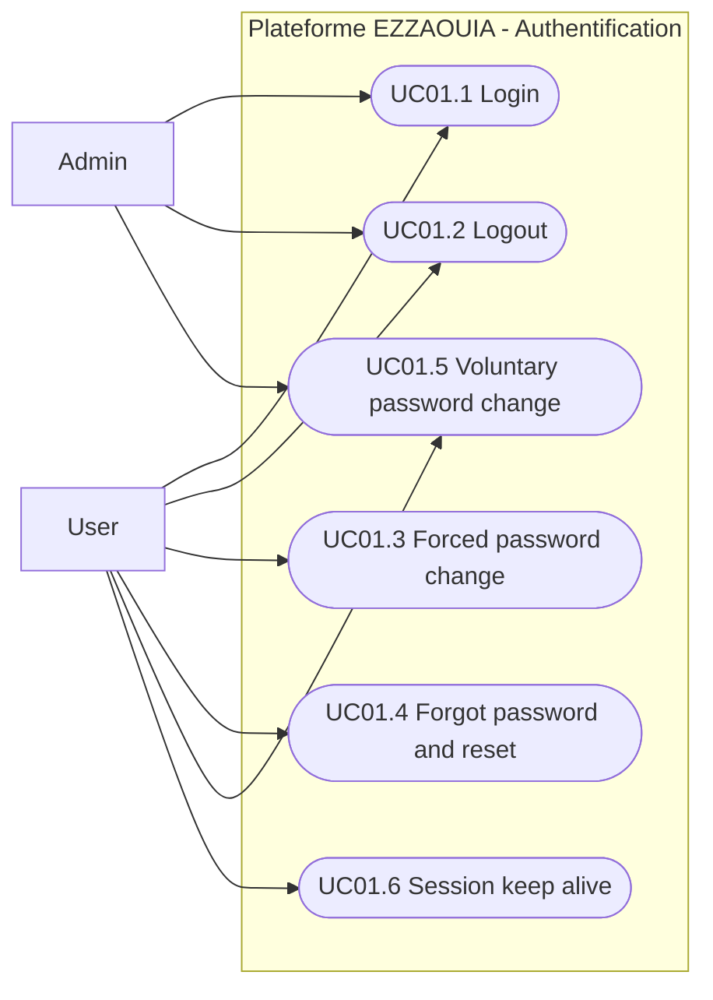

# UC01 - Authentication and Session Management

## Fiche

| Champ | Valeur |
|---|---|
| ID | UC01 |
| Domaine | accounts |
| Acteurs | User, Admin |
| Objectif | Authentifier les utilisateurs et gerer la session en securite |

## Diagramme de cas d'utilisation

## Cas couverts

1. UC01.1 Login
2. UC01.2 Logout
3. UC01.3 Forced Password Change (First Login)
4. UC01.4 Forgot Password / Self-Service Reset
5. UC01.5 Voluntary Password Change
6. UC01.6 Session Keep-Alive
