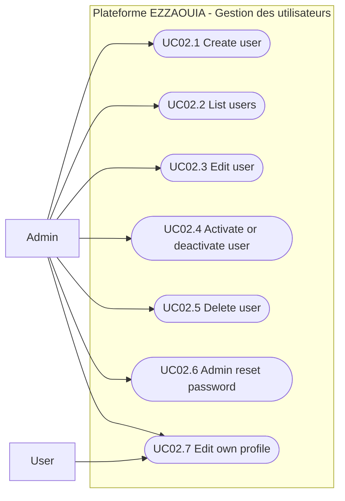

# UC02 - User Management

## Fiche

| Champ | Valeur |
|---|---|
| ID | UC02 |
| Domaine | accounts |
| Acteurs | Admin, User |
| Objectif | Administrer le cycle de vie des comptes utilisateurs |

## Diagramme de cas d'utilisation

## Cas couverts

1. UC02.1 Create User
2. UC02.2 List Users
3. UC02.3 Edit User
4. UC02.4 Activate / Deactivate User
5. UC02.5 Delete User
6. UC02.6 Admin Reset Password
7. UC02.7 Edit Own Profile
