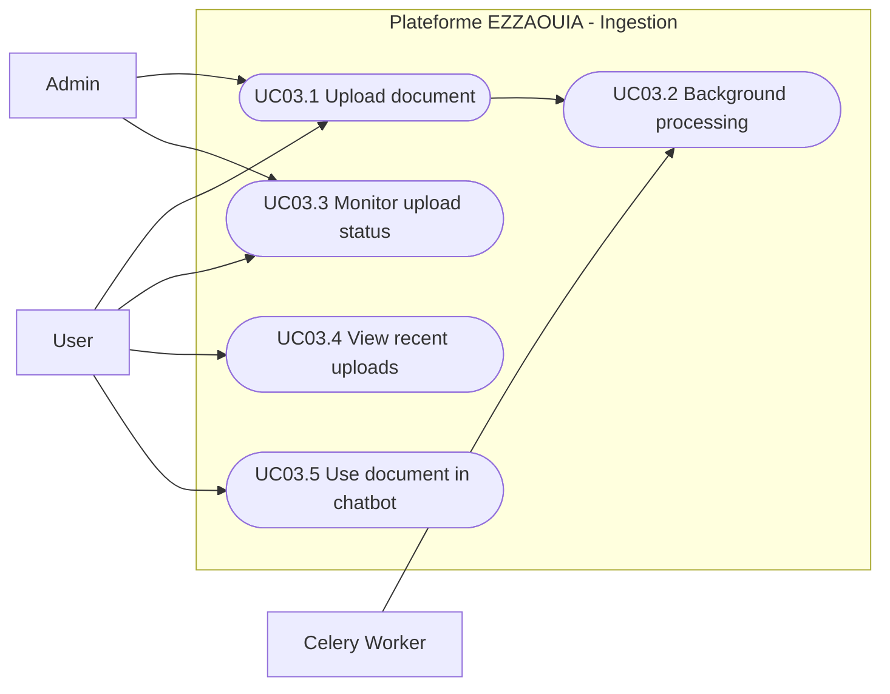

# UC03 - File Ingestion and Document Processing

## Fiche

| Champ | Valeur |
|---|---|
| ID | UC03 |
| Domaine | ingestion |
| Acteurs | User, Admin, Celery Worker |
| Objectif | Ingerer, valider, parser et indexer les documents pour le RAG |

## Diagramme de cas d'utilisation

## Cas couverts

1. UC03.1 Upload a Document
2. UC03.2 Background Processing (Celery Task)
3. UC03.3 Monitor Upload Status
4. UC03.4 View Recent Uploads
5. UC03.5 Use Uploaded Document in Chatbot
