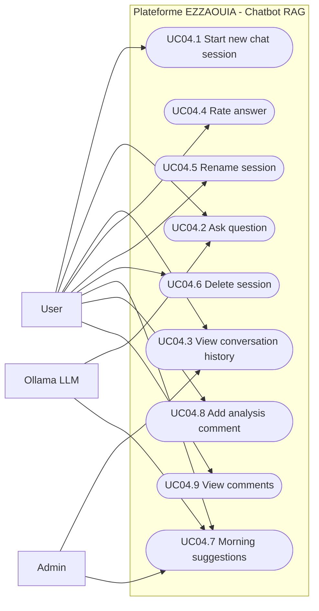

# UC04 - RAG Chatbot and AI-Powered Analysis

## Fiche

| Champ | Valeur |
|---|---|
| ID | UC04 |
| Domaine | chatbot |
| Acteurs | User, Admin, Ollama LLM |
| Objectif | Interroger les donnees et documents via une conversation assistee par IA |

## Diagramme de cas d'utilisation

## Cas couverts

1. UC04.1 Start a New Chat Session
2. UC04.2 Ask a Question
3. UC04.3 View Conversation History
4. UC04.4 Rate an Answer
5. UC04.5 Rename a Session
6. UC04.6 Delete a Session
7. UC04.7 Morning Suggestions
8. UC04.8 Add Analysis Comment
9. UC04.9 View Comments on a Message
