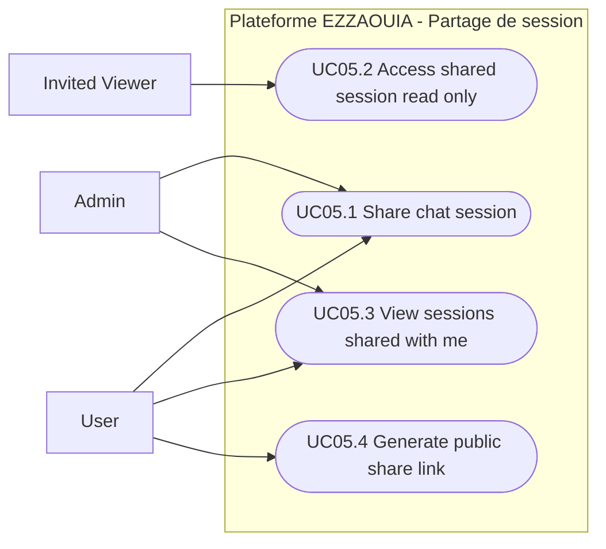

# UC05 - Session Sharing and Collaboration

## Fiche

| Champ | Valeur |
|---|---|
| ID | UC05 |
| Domaine | chatbot |
| Acteurs | User, Admin |
| Objectif | Partager une session de chat en lecture seule pour collaboration |

## Diagramme de cas d'utilisation

## Cas couverts

1. UC05.1 Share a Chat Session
2. UC05.2 Access a Shared Session (Read-Only)
3. UC05.3 View Sessions Shared With Me
4. UC05.4 Generate a Public Share Link
