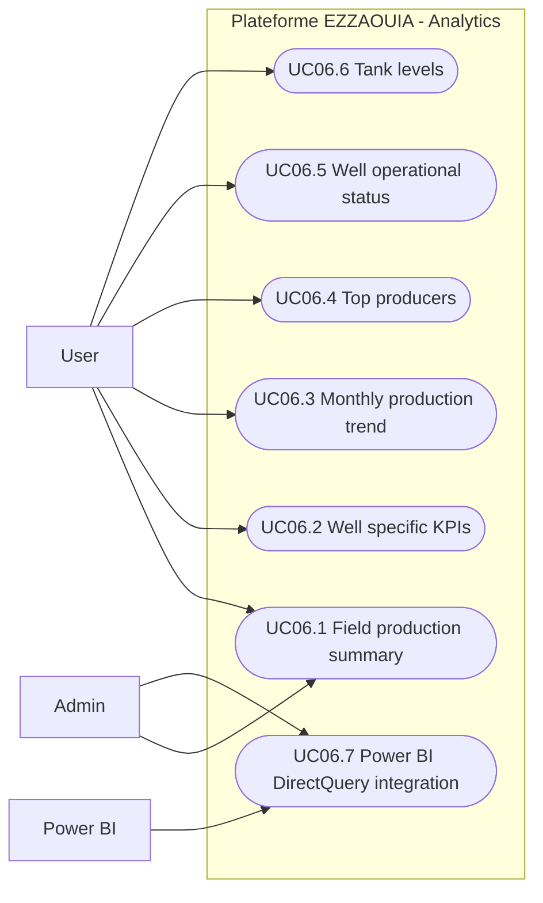

# UC06 - Production Analytics Dashboard and KPI API

## Fiche

| Champ | Valeur |
|---|---|
| ID | UC06 |
| Domaine | dashboard, kpis |
| Acteurs | User, Admin, Power BI |
| Objectif | Consulter les indicateurs de production et exposer les KPIs via API |

## Diagramme de cas d'utilisation

## Cas couverts

1. UC06.1 View Field Production Summary
2. UC06.2 View Well-Specific KPIs
3. UC06.3 View Monthly Production Trend
4. UC06.4 View Top Producers
5. UC06.5 View Well Operational Status
6. UC06.6 View Tank Levels
7. UC06.7 Power BI DirectQuery Integration
