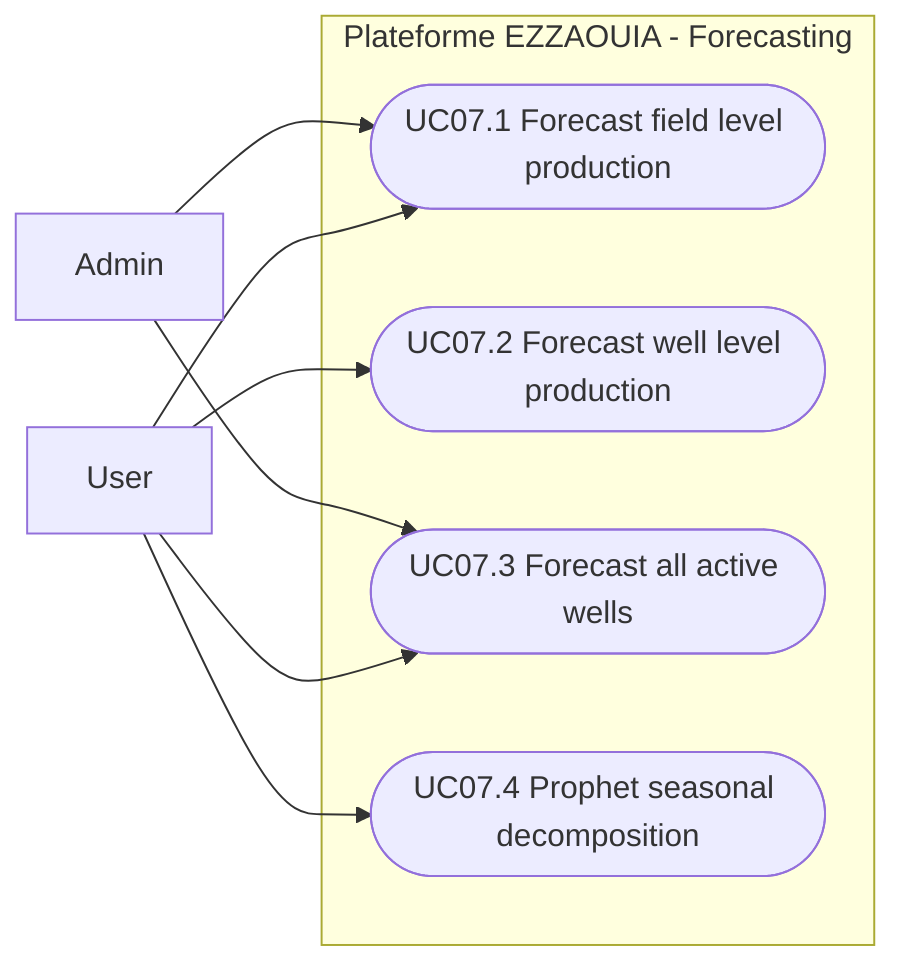

# UC07 - Production Forecasting

## Fiche

| Champ | Valeur |
|---|---|
| ID | UC07 |
| Domaine | forecasting |
| Acteurs | User, Admin |
| Objectif | Produire des previsions de production par champ et par puits |

## Diagramme de cas d'utilisation

## Cas couverts

1. UC07.1 Forecast Field-Level Production
2. UC07.2 Forecast Well-Level Production
3. UC07.3 Forecast All Active Wells
4. UC07.4 Prophet Seasonal Decomposition
