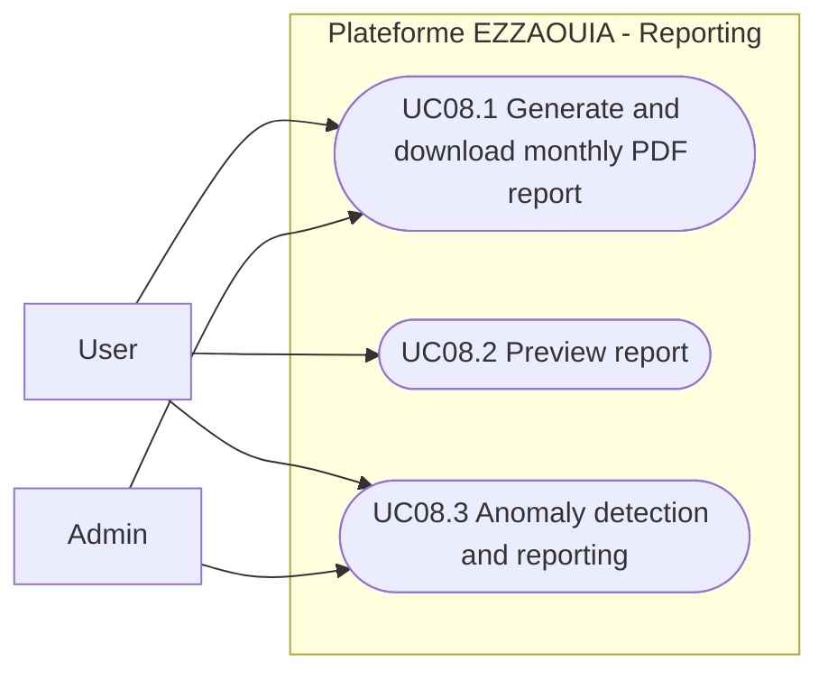

# UC08 - Monthly Production Report Generation

## Fiche

| Champ | Valeur |
|---|---|
| ID | UC08 |
| Domaine | reports |
| Acteurs | User, Admin |
| Objectif | Generer, previsualiser et telecharger les rapports PDF de production |

## Diagramme de cas d'utilisation

## Cas couverts

1. UC08.1 Generate and Download Monthly PDF Report
2. UC08.2 Preview Report (No Download)
3. UC08.3 Anomaly Detection and Reporting
