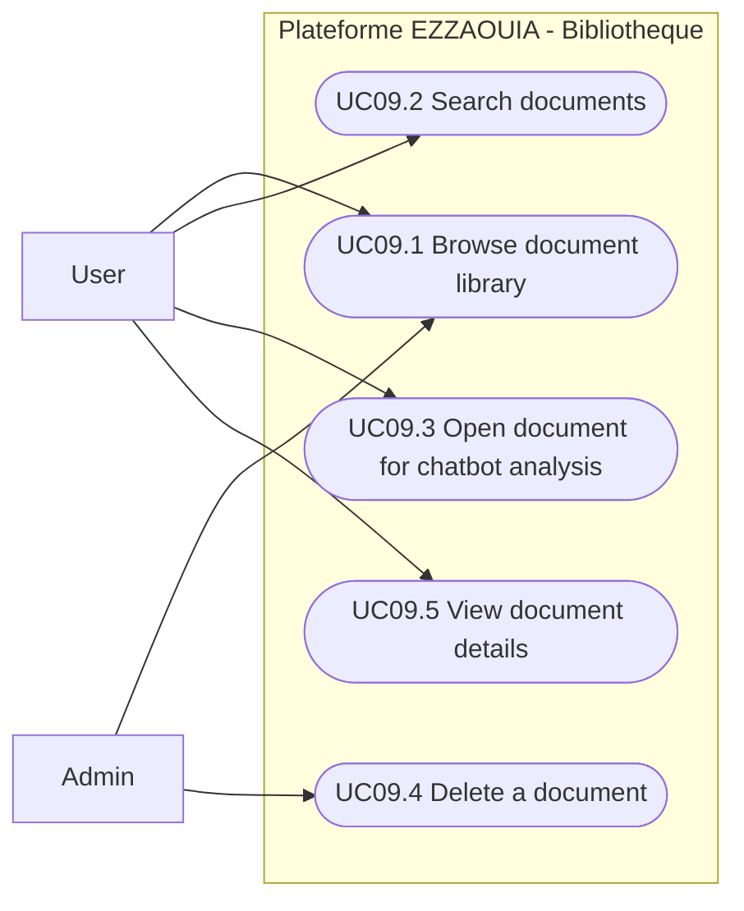

# UC09 - Document Library

## Fiche

| Champ | Valeur |
|---|---|
| ID | UC09 |
| Domaine | bibliotheque |
| Acteurs | User, Admin |
| Objectif | Consulter et administrer les documents deja indexes |

## Diagramme de cas d'utilisation

## Cas couverts

1. UC09.1 Browse Document Library
2. UC09.2 Search Documents
3. UC09.3 Open Document for Chatbot Analysis
4. UC09.4 Delete a Document
5. UC09.5 View Document Details
