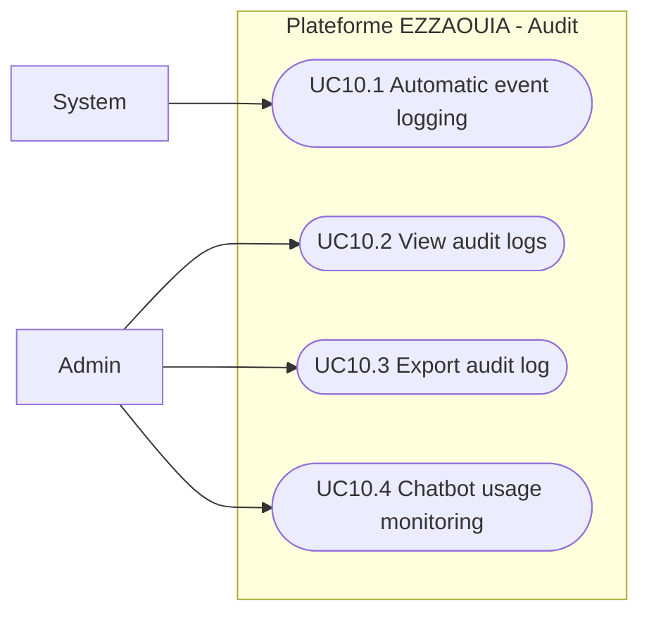

# UC10 - Audit Trail and Activity Logging

## Fiche

| Champ | Valeur |
|---|---|
| ID | UC10 |
| Domaine | audit |
| Acteurs | Admin, System |
| Objectif | Tracer les actions critiques et permettre le controle des activites |

## Diagramme de cas d'utilisation

## Cas couverts

1. UC10.1 Automatic Event Logging (System)
2. UC10.2 View Audit Logs (Admin)
3. UC10.3 Export Audit Log (Admin)
4. UC10.4 Chatbot Usage Monitoring
