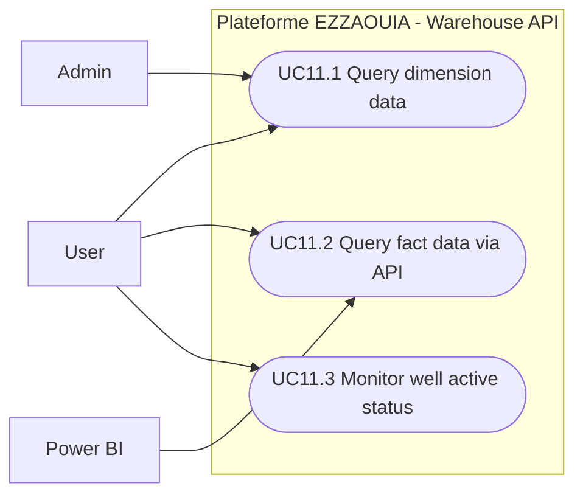

# UC11 - Warehouse Data Access

## Fiche

| Champ | Valeur |
|---|---|
| ID | UC11 |
| Domaine | warehouse |
| Acteurs | User, Admin, Power BI |
| Objectif | Exposer les donnees DWH en lecture seule pour analyse |

## Diagramme de cas d'utilisation

## Cas couverts

1. UC11.1 Query Dimension Data
2. UC11.2 Query Fact Data via API
3. UC11.3 Monitor Well Active Status
