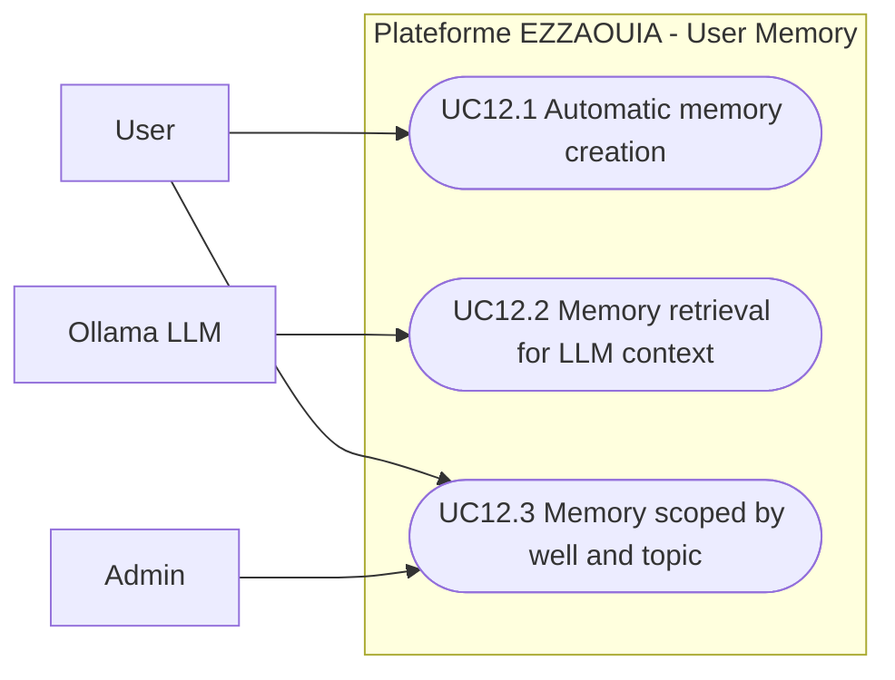

# UC12 - User Memory and Persistent AI Context

## Fiche

| Champ | Valeur |
|---|---|
| ID | UC12 |
| Domaine | chatbot |
| Acteurs | User, Admin, Ollama LLM |
| Objectif | Memoriser les preferences et informations utiles pour des reponses IA plus pertinentes |

## Diagramme de cas d'utilisation

## Cas couverts

1. UC12.1 Automatic Memory Creation
2. UC12.2 Memory Retrieval for LLM Context
3. UC12.3 Memory Scoped by Well and Topic
