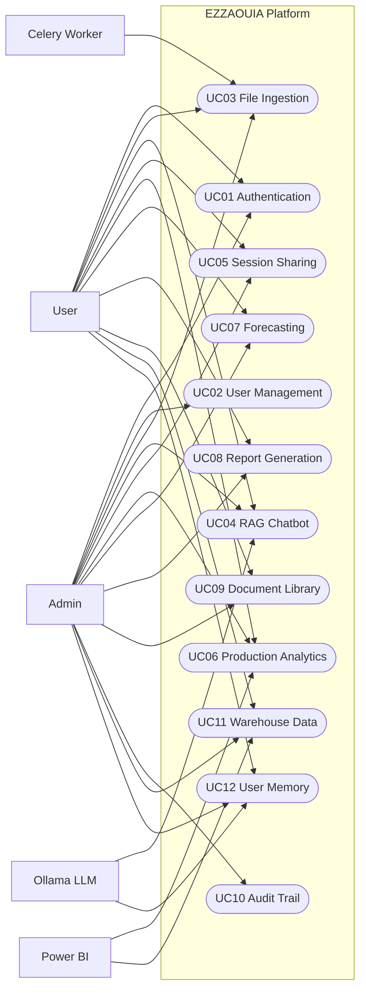

# EZZAOUIA Platform - Use Cases Index

Ce dossier contient les 12 diagrammes de cas d'utilisation (UC01 a UC12) pour le rapport.

## Diagramme global

## Liste des fichiers

1. [UC01_authentication.md](UC01_authentication.md)
2. [UC02_user_management.md](UC02_user_management.md)
3. [UC03_file_ingestion.md](UC03_file_ingestion.md)
4. [UC04_rag_chatbot.md](UC04_rag_chatbot.md)
5. [UC05_session_sharing.md](UC05_session_sharing.md)
6. [UC06_production_analytics.md](UC06_production_analytics.md)
7. [UC07_forecasting.md](UC07_forecasting.md)
8. [UC08_report_generation.md](UC08_report_generation.md)
9. [UC09_document_library.md](UC09_document_library.md)
10. [UC10_audit_trail.md](UC10_audit_trail.md)
11. [UC11_warehouse_data.md](UC11_warehouse_data.md)
12. [UC12_user_memory.md](UC12_user_memory.md)

## Couverture pour rapport

- 12/12 fichiers UC presents
- 12/12 diagrammes UC presents
- 1 diagramme global present dans cet index
