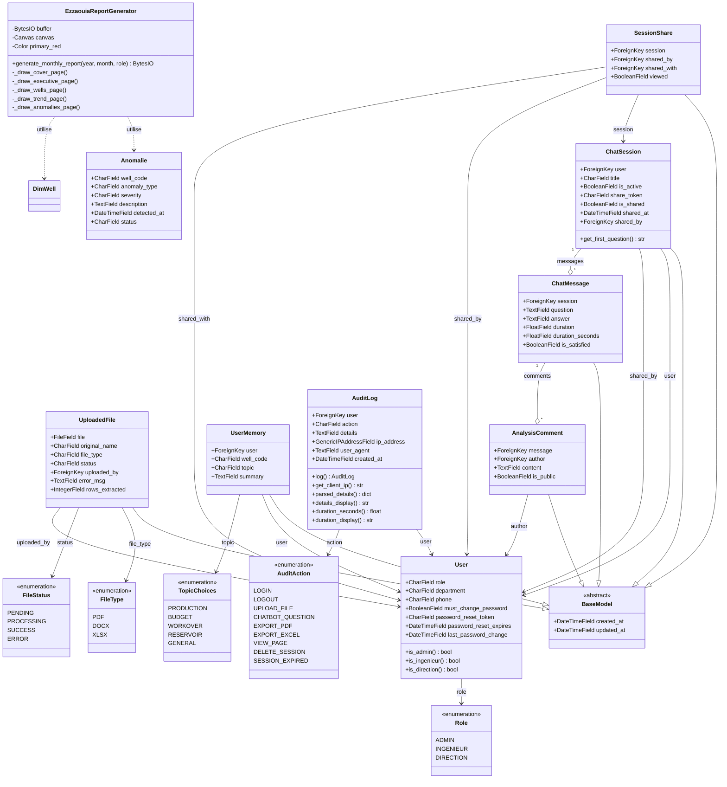
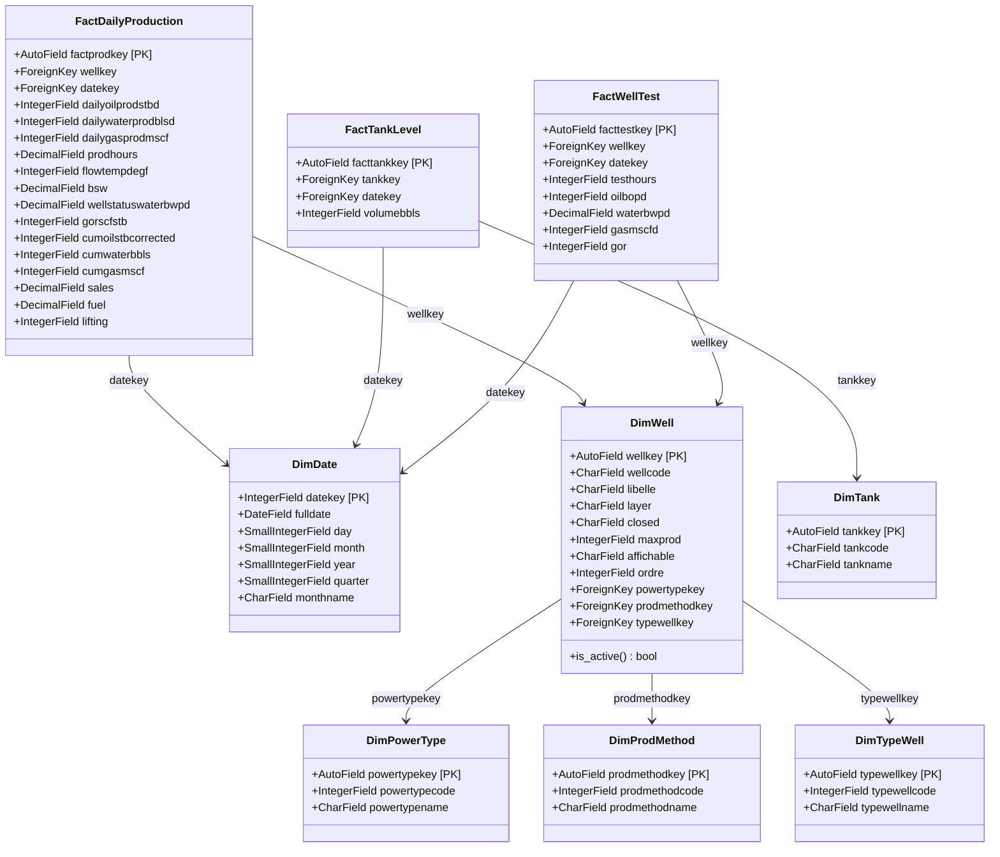
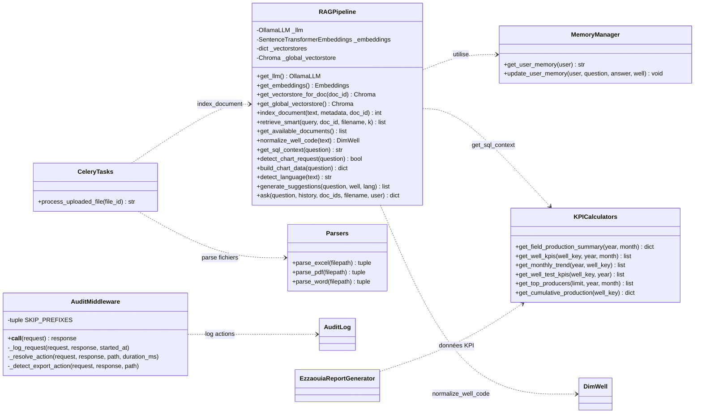

# Diagramme de Classes — EZZAOUIA Platform

## 1. Diagramme de Classes Global

---

## 2. Diagramme de Classes — Data Warehouse (Star Schema)

---

## 3. Diagramme de Classes — Services & Pipeline RAG

