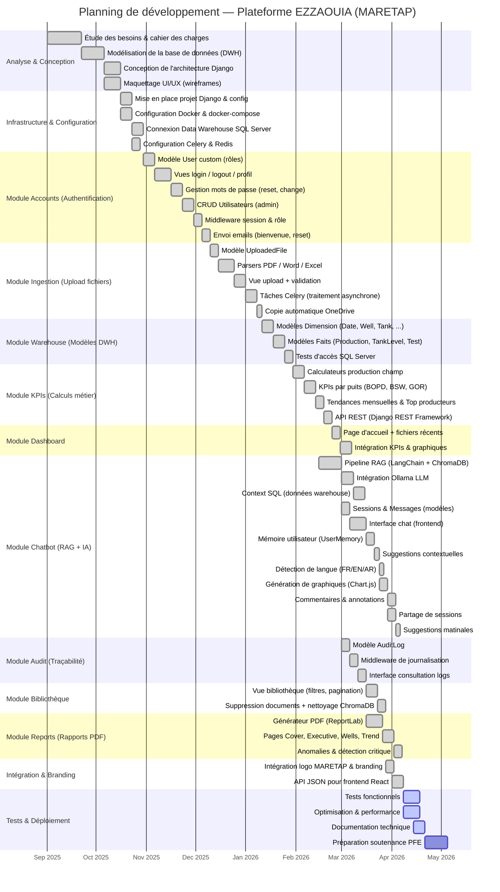
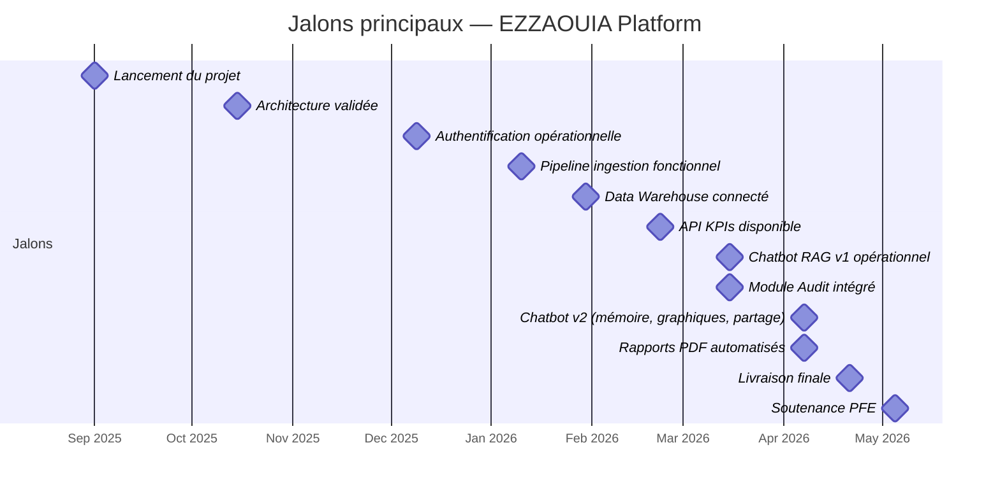

# Diagramme de Gantt — EZZAOUIA Platform

## Planning de développement du projet

```mermaid
gantt
    title Planning de développement — Plateforme EZZAOUIA (MARETAP)
    dateFormat  YYYY-MM-DD
    axisFormat  %b %Y

    section Analyse & Conception
    Étude des besoins & cahier des charges       :done, a1, 2025-09-01, 21d
    Modélisation de la base de données (DWH)     :done, a2, 2025-09-22, 14d
    Conception de l'architecture Django           :done, a3, 2025-10-06, 10d
    Maquettage UI/UX (wireframes)                :done, a4, 2025-10-06, 10d

    section Infrastructure & Configuration
    Mise en place projet Django & config          :done, b1, 2025-10-16, 7d
    Configuration Docker & docker-compose         :done, b2, 2025-10-16, 7d
    Connexion Data Warehouse SQL Server           :done, b3, 2025-10-23, 7d
    Configuration Celery & Redis                  :done, b4, 2025-10-23, 5d

    section Module Accounts (Authentification)
    Modèle User custom (rôles)                   :done, c1, 2025-10-30, 7d
    Vues login / logout / profil                 :done, c2, 2025-11-06, 10d
    Gestion mots de passe (reset, change)        :done, c3, 2025-11-16, 7d
    CRUD Utilisateurs (admin)                    :done, c4, 2025-11-23, 7d
    Middleware session & rôle                     :done, c5, 2025-11-30, 5d
    Envoi emails (bienvenue, reset)              :done, c6, 2025-12-05, 5d

    section Module Ingestion (Upload fichiers)
    Modèle UploadedFile                          :done, d1, 2025-12-10, 5d
    Parsers PDF / Word / Excel                   :done, d2, 2025-12-15, 10d
    Vue upload + validation                      :done, d3, 2025-12-25, 7d
    Tâches Celery (traitement asynchrone)        :done, d4, 2026-01-01, 7d
    Copie automatique OneDrive                   :done, d5, 2026-01-08, 3d

    section Module Warehouse (Modèles DWH)
    Modèles Dimension (Date, Well, Tank, ...)    :done, e1, 2026-01-11, 7d
    Modèles Faits (Production, TankLevel, Test)  :done, e2, 2026-01-18, 7d
    Tests d'accès SQL Server                     :done, e3, 2026-01-25, 5d

    section Module KPIs (Calculs métier)
    Calculateurs production champ                :done, f1, 2026-01-30, 7d
    KPIs par puits (BOPD, BSW, GOR)             :done, f2, 2026-02-06, 7d
    Tendances mensuelles & Top producteurs       :done, f3, 2026-02-13, 5d
    API REST (Django REST Framework)             :done, f4, 2026-02-18, 5d

    section Module Dashboard
    Page d'accueil + fichiers récents            :done, g1, 2026-02-23, 5d
    Intégration KPIs & graphiques                :done, g2, 2026-02-28, 7d

    section Module Chatbot (RAG + IA)
    Pipeline RAG (LangChain + ChromaDB)          :done, h1, 2026-02-15, 14d
    Intégration Ollama LLM                       :done, h2, 2026-03-01, 7d
    Context SQL (données warehouse)              :done, h3, 2026-03-08, 7d
    Sessions & Messages (modèles)                :done, h4, 2026-03-01, 5d
    Interface chat (frontend)                    :done, h5, 2026-03-06, 10d
    Mémoire utilisateur (UserMemory)             :done, h6, 2026-03-16, 5d
    Suggestions contextuelles                    :done, h7, 2026-03-21, 3d
    Détection de langue (FR/EN/AR)               :done, h8, 2026-03-24, 3d
    Génération de graphiques (Chart.js)          :done, h9, 2026-03-24, 5d
    Commentaires & annotations                   :done, h10, 2026-03-29, 5d
    Partage de sessions                          :done, h11, 2026-03-29, 5d
    Suggestions matinales                        :done, h12, 2026-04-03, 3d

    section Module Audit (Traçabilité)
    Modèle AuditLog                              :done, i1, 2026-03-01, 5d
    Middleware de journalisation                  :done, i2, 2026-03-06, 5d
    Interface consultation logs                   :done, i3, 2026-03-11, 5d

    section Module Bibliothèque
    Vue bibliothèque (filtres, pagination)        :done, j1, 2026-03-16, 7d
    Suppression documents + nettoyage ChromaDB    :done, j2, 2026-03-23, 5d

    section Module Reports (Rapports PDF)
    Générateur PDF (ReportLab)                   :done, k1, 2026-03-16, 10d
    Pages Cover, Executive, Wells, Trend         :done, k2, 2026-03-26, 7d
    Anomalies & détection critique               :done, k3, 2026-04-02, 5d

    section Intégration & Branding
    Intégration logo MARETAP & branding          :done, l1, 2026-03-28, 5d
    API JSON pour frontend React                 :done, l2, 2026-04-01, 7d

    section Tests & Déploiement
    Tests fonctionnels                           :active, m1, 2026-04-08, 10d
    Optimisation & performance                   :active, m2, 2026-04-08, 10d
    Documentation technique                      :active, m3, 2026-04-14, 7d
    Préparation soutenance PFE                   :        m4, 2026-04-21, 14d
```

---

## Jalons clés du projet

```mermaid
gantt
    title Jalons principaux — EZZAOUIA Platform
    dateFormat  YYYY-MM-DD
    axisFormat  %b %Y

    section Jalons
    Lancement du projet                          :milestone, 2025-09-01, 0d
    Architecture validée                         :milestone, 2025-10-15, 0d
    Authentification opérationnelle              :milestone, 2025-12-09, 0d
    Pipeline ingestion fonctionnel               :milestone, 2026-01-10, 0d
    Data Warehouse connecté                      :milestone, 2026-01-30, 0d
    API KPIs disponible                          :milestone, 2026-02-22, 0d
    Chatbot RAG v1 opérationnel                  :milestone, 2026-03-15, 0d
    Module Audit intégré                         :milestone, 2026-03-15, 0d
    Chatbot v2 (mémoire, graphiques, partage)    :milestone, 2026-04-07, 0d
    Rapports PDF automatisés                     :milestone, 2026-04-07, 0d
    Livraison finale                             :milestone, 2026-04-21, 0d
    Soutenance PFE                               :milestone, 2026-05-05, 0d
```
