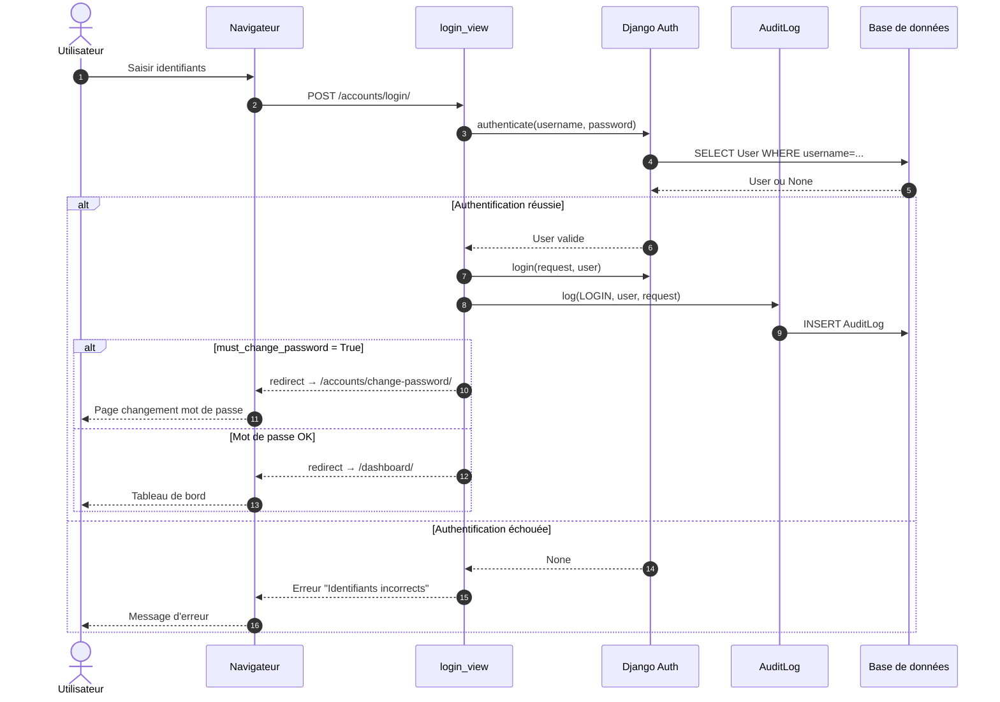
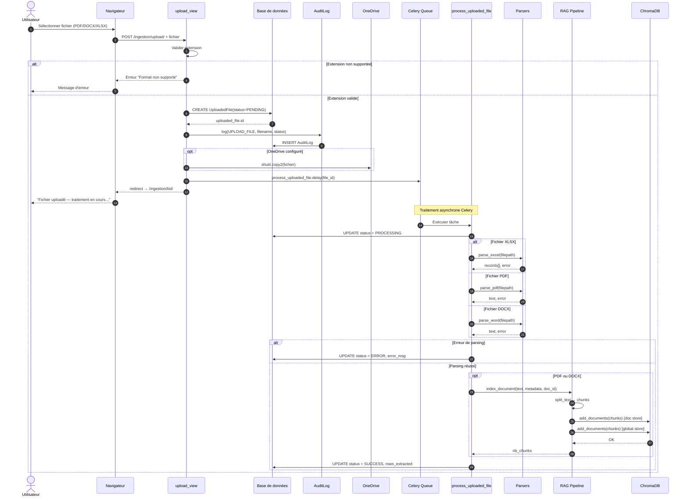
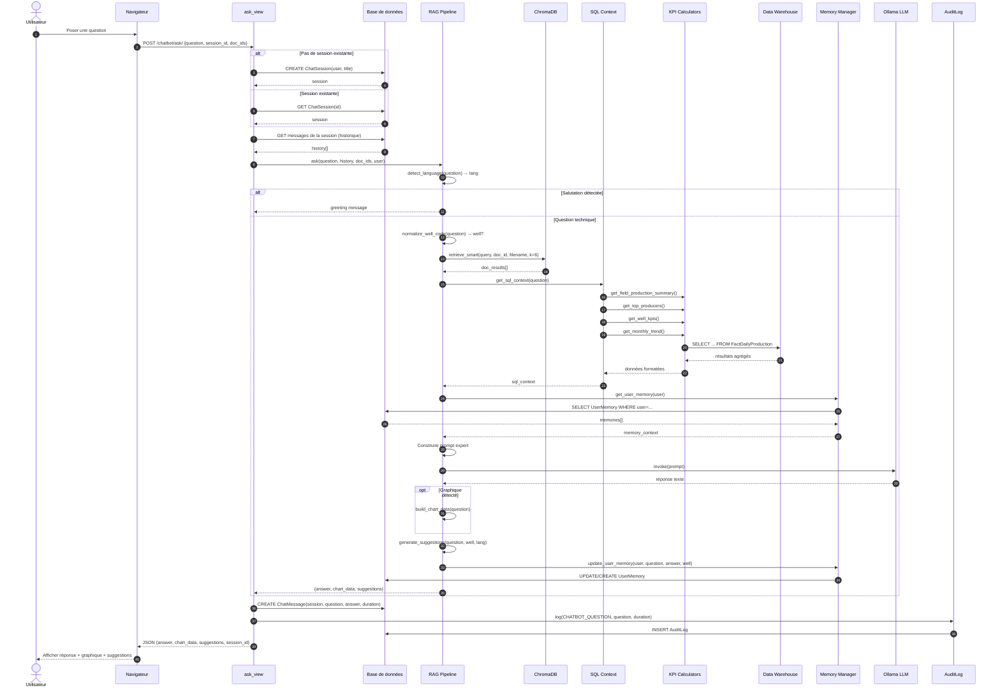
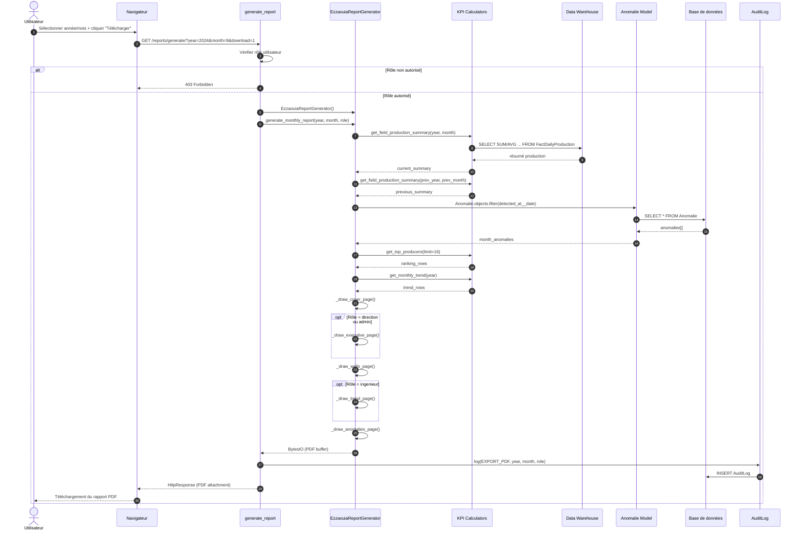
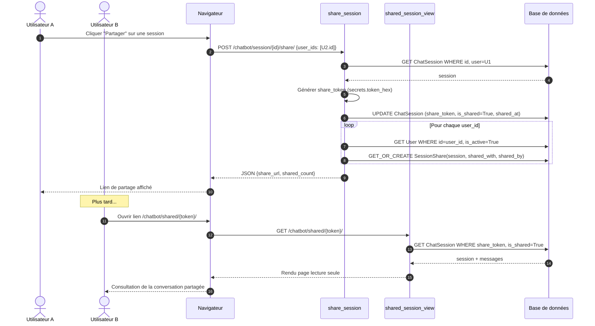
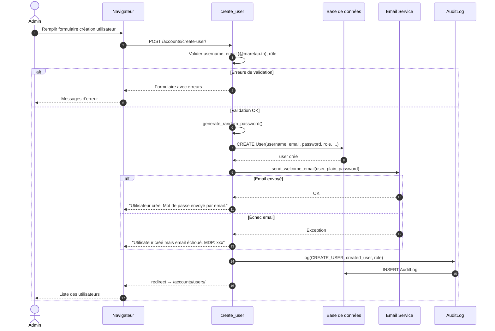
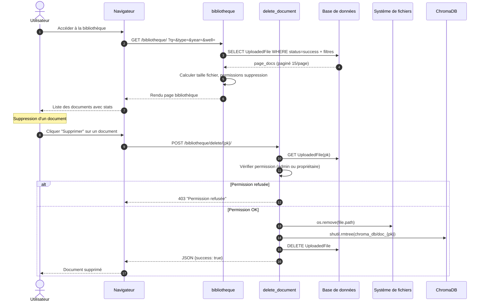

# Diagrammes de Séquence — EZZAOUIA Platform

## 1. Authentification (Login / Logout)

---

## 2. Ingestion de Fichiers (Upload + Traitement Celery)

---

## 3. Chatbot — Question RAG avec Mémoire

---

## 4. Génération de Rapports PDF

---

## 5. Partage de Session Chatbot

---

## 6. Gestion des Utilisateurs (Admin)

---

## 7. Bibliothèque documentaire

